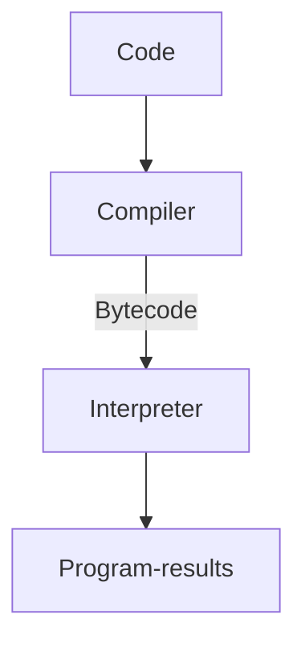
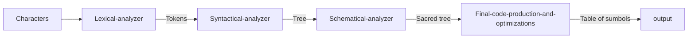

# Interprented programming language
Welcome to the project. I hope you like the personal project i am creating
the language is called **Sof-pet**
something with cats (Kitso, Sesil, Wilhelm, Monika, First lady)

**Personal goals:**
- Manage to understand more about programming languages i am working wiht like python and java and get a deep dive into how (simplified) they process my code and turn it into machine code so that it can run
- Manage to use better Git, C and Nvim for future works and self improvement
- Have fun 😁 (Should not overthink this) 

# Structure 

## **General parts:** 

## **Compiler parts:**

The **Characters** consists of the algorithm code the user wants to create. It could be a folder or a series of functions that the user puts in real time

The **Lexical analyzer** and also the **Parser** are meant to recognize the structure of the program but not it's meaning. Which means that it takes the series of the strings and groups them into tokens or figures of the language
Its main purpose is to simplify the work of the **Syntactical analyzer** and minimize the amount of input values to the minimum

The **Syntactical analyzer** organizes all the words/tokens in a tree, called the **parse tree**, which represents the structure of the components in relation to the components of which they are composed

The speciffic structure of the **parse tree** is set by some rules which are called **Context-free grammar**

The **Schematical analyzer** is finding out the meaning of the program
It finds and stores the types of the identifications and the sentences 
It finds many occurences of a identifier meant for the same entity

# Features of the language
this is a test to find out how the preview works.

